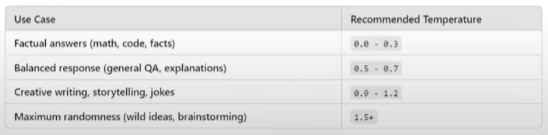

Temperature:
Temperature is a parameter that controls the randomness of a language model's output. It affects how creative or deterministic the respones are:
Lower Values (0.0-0.3) : More deterministic and predictable.
Higher Values(0.7-1.5) : More random, creative, and diverse.

Max_Completion_Tokens:
This is a built in function that limits the no. of tokens used to get a output. You are priced upon the no. of tokens used for the specific Prompt. So, mostly as a dev you can limit the user's need of generating a answer for the same.